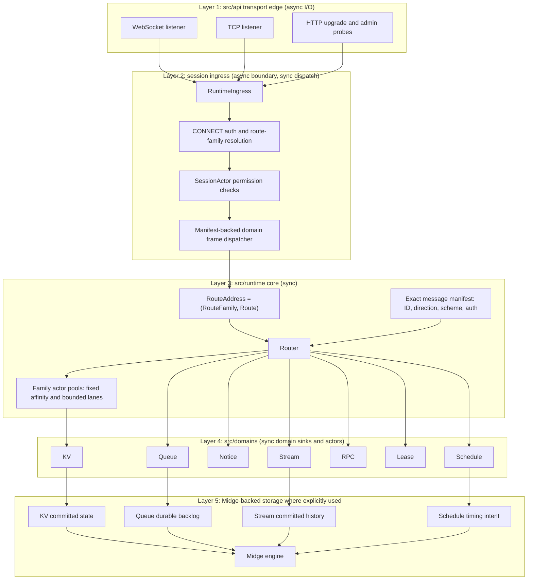
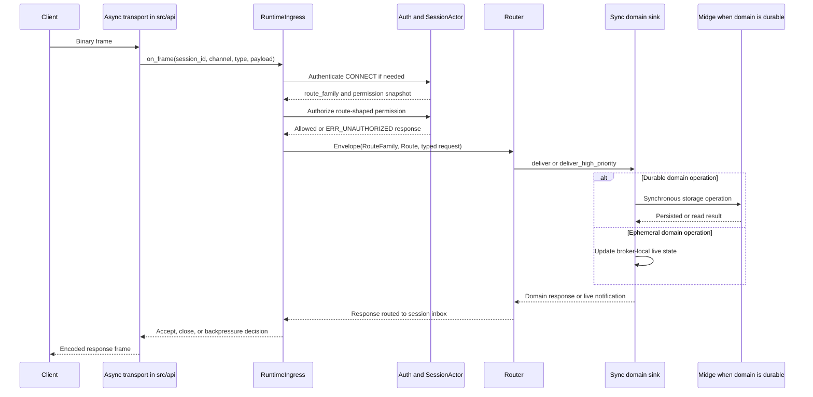
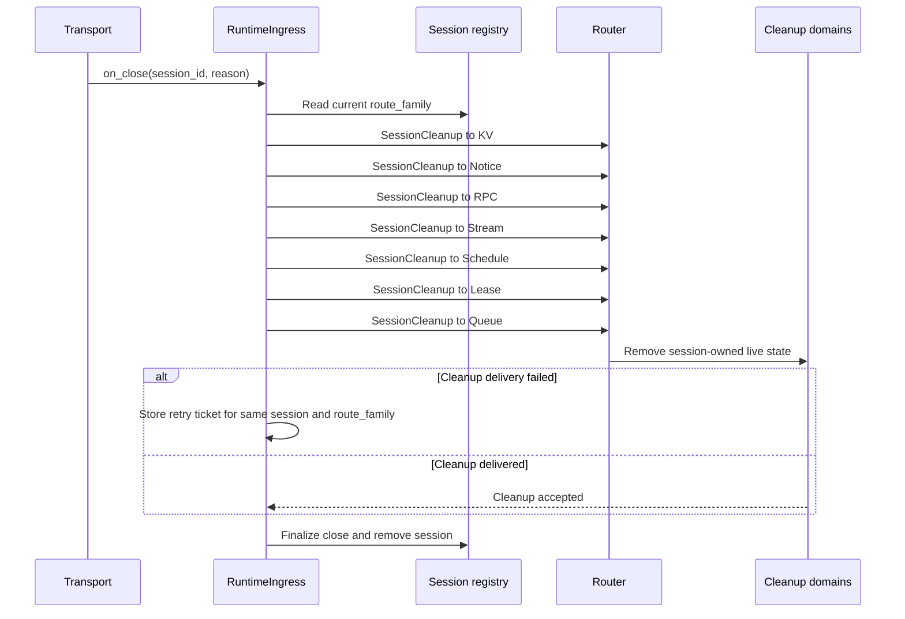
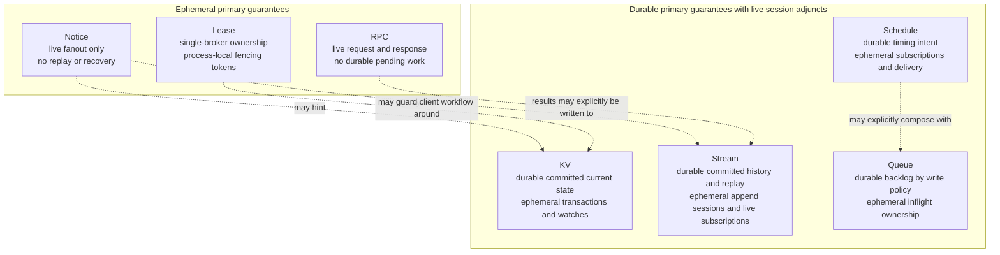
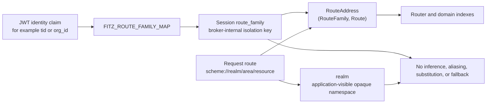
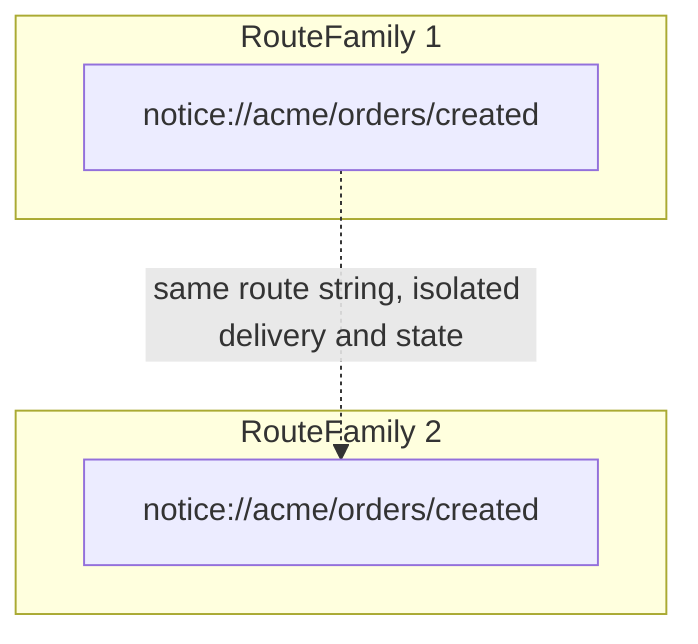

# Fitz Architecture Diagrams

**Status**: Repo-native architecture reference
**Scope**: Core broker architecture
**Authority**: These diagrams summarize the current architecture. If they conflict with
[architectural-laws.md](architectural-laws.md),
[domain-boundaries-spec.md](domain-boundaries-spec.md), or source, treat the conflict
as a documentation or implementation defect and resolve it explicitly.

These diagrams intentionally do not imply durability, replay, ownership continuity,
recovery, exactly-once delivery, or fused domain semantics beyond the guarantees in
the authoritative documents.

## Layered Broker Architecture

## Request Lifecycle

The session route family comes from authenticated session state. The request
realm comes from the route string. They are carried together as a route address
and are not inferred from each other.

## Disconnect Cleanup

Cleanup removes only session-owned live state:

| Domain | Removed on disconnect | Explicitly retained if already durable |
| --- | --- | --- |
| KV | open transactions, resource locks, live watches | committed current state |
| Notice | subscriptions and queued live notifications | nothing |
| RPC | worker registrations, pending live requests, reply routing | nothing |
| Stream | live subscriptions and uncommitted append sessions | committed records, offsets, watermarks |
| Schedule | live subscriptions | definitions, next-fire state, pending fire claims |
| Lease | held leases, waiters, lease watches | nothing |
| Queue | live inflight ownership and queue watches | durable backlog, delayed entries, DLQ state under the configured write policy |

A reconnect creates a new session. Clients must explicitly re-authenticate,
re-subscribe, re-register, reopen transactions, reacquire leases, or resume from
client-managed offsets where the domain supports explicit durable reads.

## Domain Semantics

Dotted edges are optional explicit composition. They do not transfer guarantees
between domains.

## Route Isolation

The comparison edge above documents isolation, not delivery. A route lookup,
subscription match, queue operation, stream read, KV transaction, lease
operation, RPC dispatch, or schedule operation in one route family must not
observe state from another route family.
