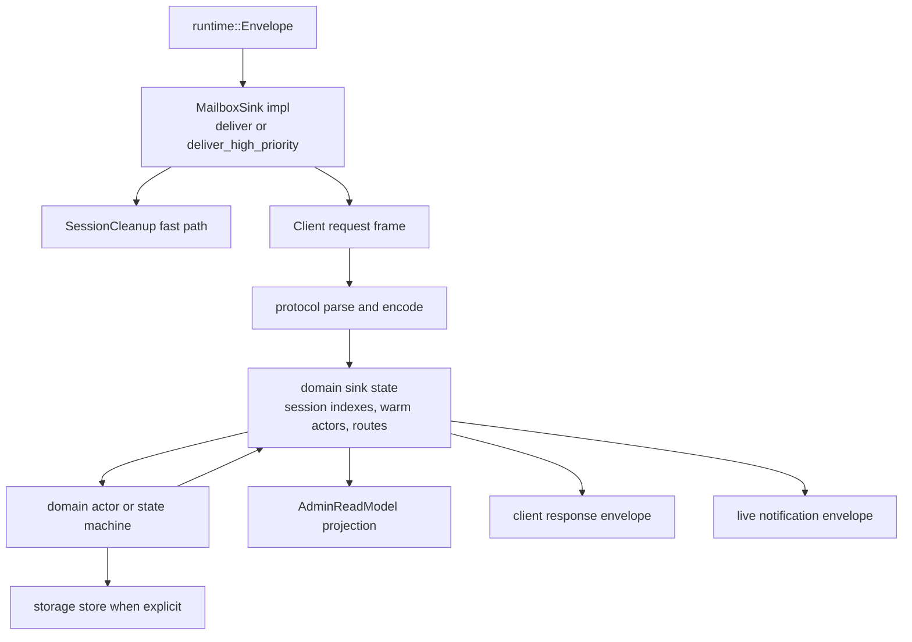
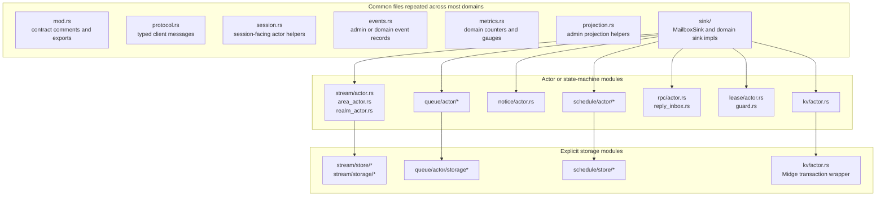
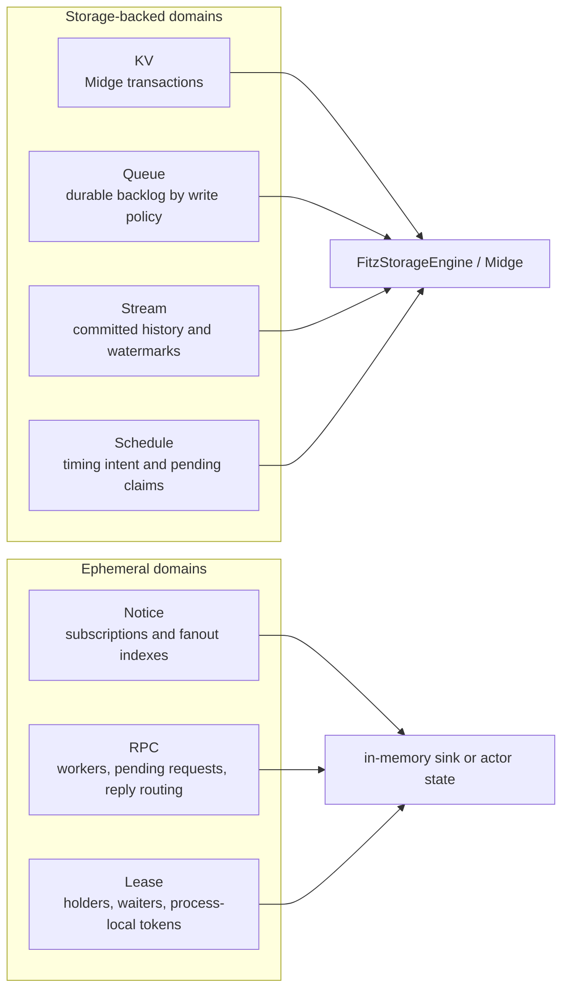
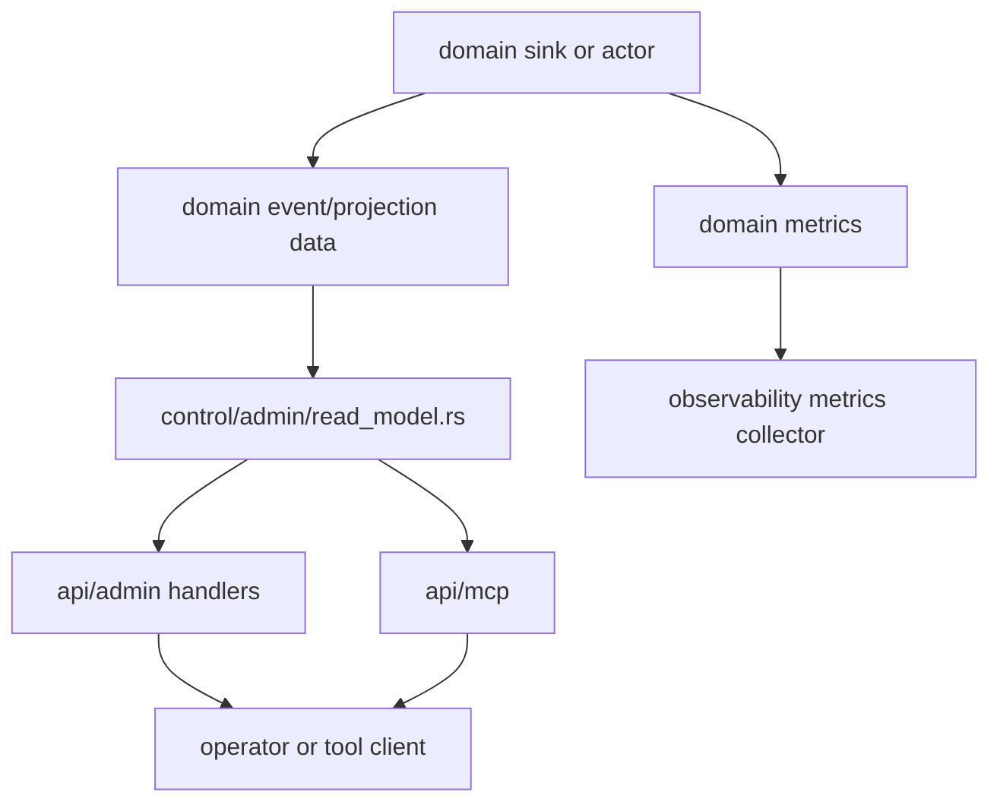

# Fitz Code Architecture Domain Patterns

**Status**: Source-structure reference
**Scope**: Domain implementation layout under `src/domains`

Fitz domains share implementation patterns, but each domain owns only its own
guarantees. Shared code shape must not blur domain semantics.

## Generic Domain Sink Pattern

Pattern notes:

- Cleanup is handled before normal client request parsing where possible.
- Protocol code parses wire payloads; domain sinks and actors apply mechanics.
- Admin projections describe current state; they are not correctness inputs.
- Live notifications are best-effort delivery through the router unless a domain
  explicitly defines a stronger guarantee.

## Domain Module Families

Notice and RPC do not have storage modules because their primary state is live
broker-local state. Lease also has no storage module; lease ownership, waiters,
and fencing tokens are ephemeral process-local coordination state.

## Storage-Backed Versus Ephemeral Code Paths

The storage-backed group can still own ephemeral adjunct state, such as KV
transactions, Stream append sessions, Queue inflight ownership, or Schedule live
subscriptions. The ephemeral group must not grow hidden durable recovery paths.

## Admin And Observability Flow

Admin and observability surfaces are read-side views. They can expose topology,
metrics, troubleshooting summaries, and current domain snapshots, but they must
not control retries, recovery, routing, ownership, scheduling, or domain
correctness decisions.
