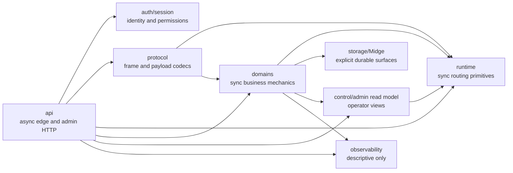
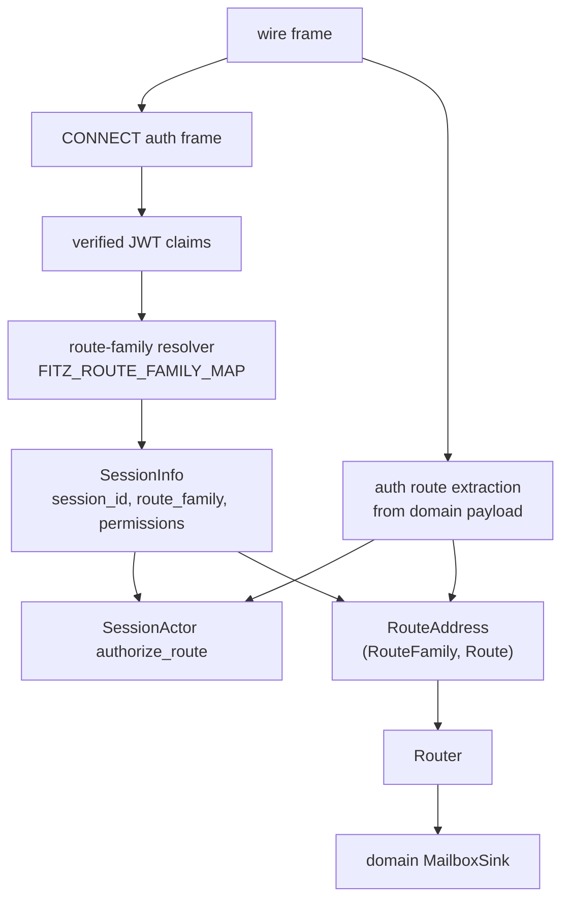

# Fitz Code Architecture Modules

**Status**: Source-structure reference
**Scope**: Rust broker workspace under `src/`

This document describes how the code is organized. It is not a replacement for
the domain contracts in [domain-boundaries-spec.md](domain-boundaries-spec.md)
or the behavioral diagrams in
[architecture-diagrams.md](architecture-diagrams.md).

## Top-Level Module Map

```mermaid
flowchart TB
    subgraph BOOT["src/boot"]
        BOOTMOD["mod.rs<br/>startup and shutdown orchestration"]
        BOOTRT["runtime/<br/>BootConfig and env parsing"]
        BOOTDOM["domains.rs<br/>domain sink construction"]
        BOOTSTOR["storage.rs<br/>Midge engine open"]
    end

    subgraph API["src/api"]
        HANDLERS["handlers/<br/>HTTP, TCP, WebSocket listeners"]
        INGRESS["runtime_ingress/<br/>auth, session registry, domain dispatch"]
        ADMIN["admin/<br/>operator APIs, assets, metrics, topology"]
        MCP["mcp/<br/>tool-facing API surface"]
        OUTBOUND["outbound.rs<br/>session response delivery"]
    end

    subgraph AUTHSESSION["auth and session"]
        AUTH["src/auth<br/>JWT, claims, permissions, route-family resolver"]
        SESSION["src/session<br/>session actor and permission checks"]
    end

    subgraph PROTO["src/protocol"]
        TLV["tlv.rs and frame modules"]
        CODECS["domain codecs<br/>kv, notice, queue, rpc, lease, stream, schedule"]
    end

    subgraph RUNTIME["src/runtime"]
        ROUTING["routing.rs<br/>RouteFamily, Route, RouteAddress"]
        ROUTER["router.rs<br/>MailboxSink delivery"]
        MANIFEST["domain_manifest.rs<br/>domain inventory and cleanup routes"]
        SCHED["scheduler.rs, actor.rs, mailbox.rs"]
        EVENTS["domain_event.rs<br/>DomainPublishEvent, SessionCleanup"]
    end

    subgraph DOMAINS["src/domains"]
        KV["kv"]
        QUEUE["queue"]
        NOTICE["notice"]
        STREAM["stream"]
        RPC["rpc"]
        LEASE["lease"]
        SCHEDULE["schedule"]
        SUBSTATE["subscription_state.rs<br/>shared routed subscription set"]
    end

    subgraph SUPPORT["supporting code"]
        STORAGE["src/storage wrapper<br/>FitzStorageEngine"]
        CONTROL["src/control<br/>admin read model and health models"]
        OBS["src/observability<br/>metrics and tracing helpers"]
        TESTKIT["src/testkit and src/benchkit"]
        CLIENT["src/client"]
    end

    BOOTMOD --> BOOTRT
    BOOTMOD --> BOOTSTOR
    BOOTMOD --> BOOTDOM
    BOOTMOD --> HANDLERS
    BOOTDOM --> KV
    BOOTDOM --> QUEUE
    BOOTDOM --> NOTICE
    BOOTDOM --> STREAM
    BOOTDOM --> RPC
    BOOTDOM --> LEASE
    BOOTDOM --> SCHEDULE
    BOOTDOM --> ROUTER
    BOOTSTOR --> STORAGE

    HANDLERS --> INGRESS
    INGRESS --> AUTH
    INGRESS --> SESSION
    INGRESS --> TLV
    INGRESS --> CODECS
    INGRESS --> ROUTER
    INGRESS --> MANIFEST
    INGRESS --> OUTBOUND

    CODECS --> KV
    CODECS --> QUEUE
    CODECS --> NOTICE
    CODECS --> STREAM
    CODECS --> RPC
    CODECS --> LEASE
    CODECS --> SCHEDULE
    KV --> ROUTING
    QUEUE --> ROUTING
    NOTICE --> ROUTING
    STREAM --> ROUTING
    RPC --> ROUTING
    LEASE --> ROUTING
    SCHEDULE --> ROUTING
    KV --> STORAGE
    QUEUE --> STORAGE
    STREAM --> STORAGE
    SCHEDULE --> STORAGE
    KV --> CONTROL
    QUEUE --> CONTROL
    NOTICE --> CONTROL
    STREAM --> CONTROL
    RPC --> CONTROL
    LEASE --> CONTROL
    SCHEDULE --> CONTROL
    KV --> OBS
    QUEUE --> OBS
    NOTICE --> OBS
    STREAM --> OBS
    RPC --> OBS
    LEASE --> OBS
    SCHEDULE --> OBS

    ADMIN --> CONTROL
    ADMIN --> OBS
    MCP --> CONTROL
    MCP --> OBS
    TESTKIT --> HANDLERS
    TESTKIT --> KV
    CLIENT --> TLV
```

## Dependency Shape

Important boundaries:

- `src/api` owns async I/O and the async/sync transition.
- `src/runtime` owns synchronous routing primitives, not domain behavior.
- `src/domains` owns domain mechanics and may use runtime types for addressing
  and delivery.
- `src/protocol` translates wire payloads into typed domain requests and
  responses.
- `src/control` and `src/api/admin` expose read models and operator views; they
  must not define correctness behavior.
- `src/observability` records what happened; disabling it must not change broker
  behavior.

## Route And Dispatch Ownership

The route family is session state. The realm is route text. Code that needs both
must carry both explicitly through `RouteAddress`.
