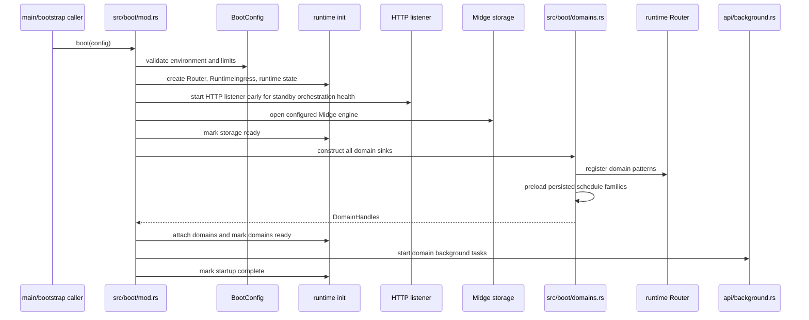
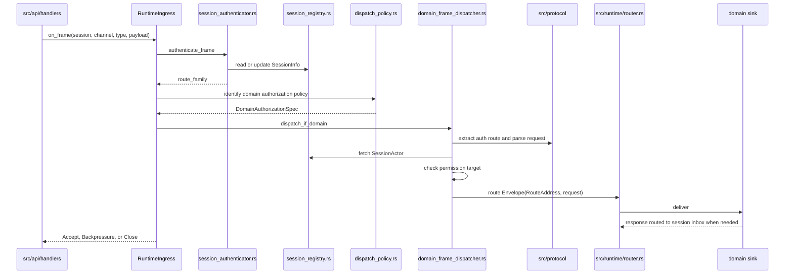
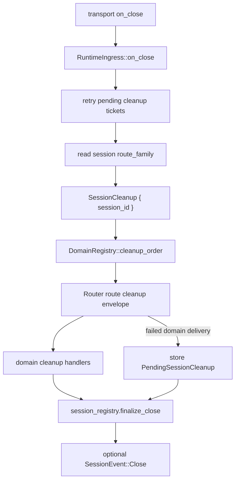
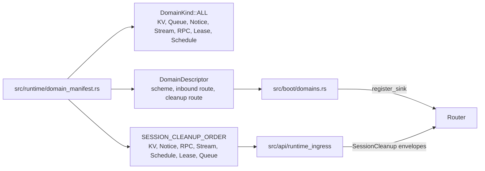

# Fitz Code Architecture Runtime Flows

**Status**: Source-structure reference
**Scope**: Boot, ingress, dispatch, and disconnect cleanup paths

These diagrams describe code flow. They intentionally avoid adding domain
guarantees beyond the authoritative domain documents.

## Boot Wiring

`/targetz` can come up before storage is ready for observation by a separate
orchestration path. It is not a customer traffic-admission signal. Data-plane
readiness still requires storage, domain registration, and startup completion.

## Frame Dispatch Path

The dispatcher is the code choke point where typed domain routing, permission
policy, and `RouteAddress` construction meet.

## Disconnect Cleanup Path

Cleanup retry tickets are only for finishing cleanup delivery. They do not
restore a session, subscriptions, workers, transactions, leases, stream append
sessions, or queue inflight ownership.

## Domain Registration And Cleanup Manifest

Adding a domain requires updating the manifest, boot registration, ingress
authorization/dispatch metadata, protocol codecs, admin/read-model surfaces, and
tests that prove cleanup coverage.
